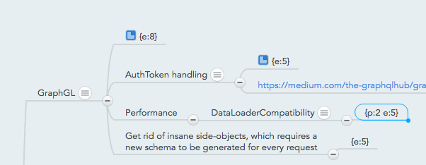

### Mindmeister Estimate Reader

Estimating requires agility to deal with the dynamic and uncertain nature of the craft.  Mindmeister allows information structures to be editied efficiently, but does not offer estimate aggregation or simple meta data association.

**Note:** This tool does not use the estimates stored on the items' properties, rather its own system.

The aim of this project has been to create a separate GUI for Mindmeister, where the following can be editied efficiently within the mind map:

* Estimate, aggregated down
* Priority, aggregated up
* Risk
* Sprint name

For this to work, a special syntax is used, where nodes are appended to the target element.  The syntax is as following:

    {e:nn p:nn r:nn s:aa}

Where nn is any number, aa is alhphanumerical.  

Sample notation, usage:

To start:

API_KEY='xxxxxx' SECRET_KEY='xxxxxx' node index.js

URL:

http://localhost:3000/[MapId]/[AuthCode]

The mapId are found by opening the map in the GUI.  The AuthCode can be obtained by using the API test tools, just make sure you are operating on the corresponding API_KEY.

This tool was built to support the development of the [Digital Value Network](http://digitalvaluenetwork.com)
